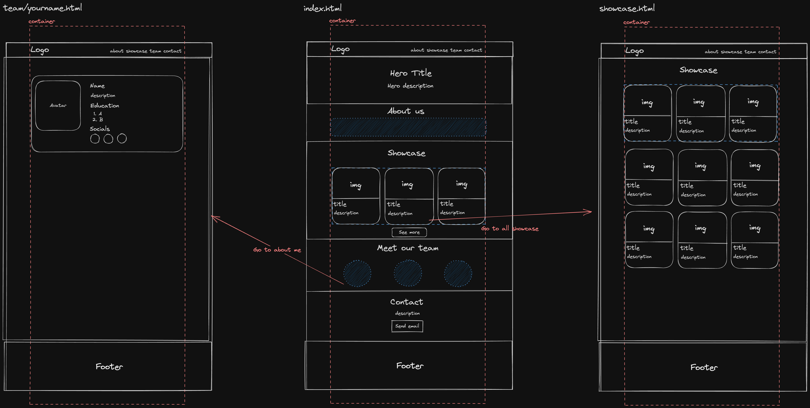

# Tech Camp Workshop Portfolio

_บทความนี้จะทําขึ้นเพื่อใช้ในการสอนน้อง ๆ เขียนเว็บในค่าย Tech Camp #1 จัดโดยชมรม [KU Tech](https://kutech.club)_

ในบทความนี้จะเป็นตัวอย่างในการทําเว็บไซต์ Portfolio แบบทีม 3 คน เพื่อเป็นแนวทางให้น้อง ๆ สามารถนําไปเริ่มต้นเป็นแบบของเว็บไซต์น้อง ๆ เองได้

> 💡 ทั้งหมดที่เห็นเป็นเพียงการออกแบบของพี่เท่านั้น น้อง ๆ สามารถออกแบบดีไซน์ได้ตามความต้องการของน้อง ๆ เลย

[สามารถดูตัวอย่าง Live demo ได้ที่นี่](https://qu1etboy.github.io/tech-camp-workshop/index.html)

## ออกแบบเว็บไซต์

ในขั้นตอนนี้จะเป็นการออกแบบเว็บไซต์ว่าในเว็บของเรานั้นจะมีเนื้อหาอะไรบ้าง และจะจัดวางเนื้อหานั้นอย่างไร โดยวิธีการออกแบบสามารถทําได้หลายวิธีดังนี้

- กระดาษ -> ใช้กระดาษร่างตัวเว็บคร่าว ๆ ออกมาโดยกําหนดจํานวนหน้าและเนื้อหาที่จะแสดงกําหนดออกมาเป็นส่วน ๆ
- Excalidraw -> เป็นเว็บไซต์ที่ใช้ร่างเว็บไซต์ได้ฟิวคล้าย ๆ whiteboard
- Figma -> สําหรับคน advance ที่มีทักษะก็สามารถใช้ได้่เช่นกัน

โดยที่พี่ทําจะมีเนื้อหาอยู่ด้วยกันคือ

- หน้าหลัก

  - hero section
  - about section
  - showcase section -> มีปุ่มให้ไปหน้า showcase ได้
  - team section -> มีปุ่มให้ไปหน้าประวัติของ team แต่ละคน
  - contact section

- หน้า showcase
- หน้า ประวัติของ team แต่ละคน

โดยในการออกแบบนี้พี่จะให้เว็บไซต์ของพี่มี theme เป็น dark theme คือเน้นพื้นหลังสีดํา ข้อความสีขาว ซึ้งได้ออกมาประมาณนี้



> ในที่นี้พี่ใช้ excalidraw สร้างนะ

## เขียนโครงสร้าง

หลังจากที่เราได้ทําการออกแบบเสร็จแล้วก็มาเริ่มการเขียนโครงสร้างกัน

```html
<!DOCTYPE html>
<html lang="en">
  <head>
    <meta charset="UTF-8" />
    <meta http-equiv="X-UA-Compatible" content="IE=edge" />
    <meta name="viewport" content="width=device-width, initial-scale=1.0" />
    <meta name="description" content="Portfolio website" />

    <title>Portfolio</title>

    <link rel="icon" type="image/x-icon" href="../assets/favicon.ico" />
  </head>
  <body>
    <!-- Your content goes here -->
  </body>
</html>
```

ในที่นี้เรามีการเพิ่ม

```html
<meta name="description" content="Portfolio website" />
```

ที่เป็นการกําหนดคําอธิบายของเว็บไซต์ ซึ่งอธิบายว่าเว็บไซต์นี้เกี่ยวกับอะไร และ

```html
<link rel="icon" type="image/x-icon" href="../assets/favicon.ico" />
```

เพื่อเพิ่ม icon ให้กับเว็บไซต์ตอนแสดงที่แท็บบาร์

## ติดตั้ง Bootstrap

```html
<link
  href="https://cdn.jsdelivr.net/npm/bootstrap@5.3.0/dist/css/bootstrap.min.css"
  rel="stylesheet"
  integrity="sha384-9ndCyUaIbzAi2FUVXJi0CjmCapSmO7SnpJef0486qhLnuZ2cdeRhO02iuK6FUUVM"
  crossorigin="anonymous"
/>
<script
  defer
  src="https://cdn.jsdelivr.net/npm/bootstrap@5.3.0/dist/js/bootstrap.bundle.min.js"
  integrity="sha384-geWF76RCwLtnZ8qwWowPQNguL3RmwHVBC9FhGdlKrxdiJJigb/j/68SIy3Te4Bkz"
  crossorigin="anonymous"
></script>
```

ถ้าอยากใช้ Bootstrap icon ด้วยให้เพิ่มอันนี้ไปด้วย

```html
<link
  rel="stylesheet"
  href="https://cdn.jsdelivr.net/npm/bootstrap-icons@1.10.5/font/bootstrap-icons.css"
/>
```

[ดูการใช้งานได้ที่นี่](https://icons.getbootstrap.com/)

ในตัวอย่างนี้มีการเพิ่ม css เพิ่มเติมด้วยสามารถดูได้ที่ [styles.css](./css/styles.css)

## เพิ่มเนื้อหา

### 1. Navbar

ส่วนนี้คือส่วน Navigation เพื่อใช้ไปยังส่วนต่าง ๆ หรือหน้าต่าง ๆ ของเว็บไซต์

```html
<nav
  id="navbar"
  class="navbar sticky-top navbar-expand-lg navbar-dark bg-black bg-opacity-75 border-bottom border-dark py-3"
  style="backdrop-filter: blur(10px)"
>
  <div class="container">
    <a class="navbar-brand fw-bold" href="index.html">Portfolio</a>
    <button
      class="navbar-toggler"
      type="button"
      data-bs-toggle="collapse"
      data-bs-target="#navbarNav"
      aria-controls="navbarNav"
      aria-expanded="false"
      aria-label="Toggle navigation"
    >
      <span class="navbar-toggler-icon"></span>
    </button>
    <div class="justify-content-end collapse navbar-collapse" id="navbarNav">
      <ul class="navbar-nav">
        <li class="nav-item">
          <a class="nav-link" href="index.html#about">About</a>
        </li>
        <li class="nav-item">
          <a class="nav-link" href="index.html#showcase">Showcase</a>
        </li>
        <li class="nav-item">
          <a class="nav-link" href="index.html#team">Team</a>
        </li>
        <li class="nav-item">
          <a class="nav-link" href="index.html#contact">Contact</a>
        </li>
      </ul>
    </div>
  </div>
</nav>
```

โดยในโค้ดตัวอย่างนี้มีการ style เพิ่มเติมคือทําให้ Navbar ติดอยู๋ด้านบนหน้าจอตลอดเวลาและมีพื้นหลังจาง ๆ เอฟเฟกต์เบลอ ๆ สวย ๆ

### 2. Hero section

Hero section คือส่วนที่จะช่วยดึงดูดความสนใจของผู้ใช้งาน

ในการออกแบบของพี่มีการใช้ความรู้ในเรื่องของ `background-image` ในการเปลี่ยนรูปพื้นหลังให้เป็นรูปโลกสวย ๆ โดยสามารถนํา css class นี้ไปใช้ได้เลยหากต้องการมีพื้นหลังสวย ๆ

```css
.hero-bg {
  background-image: url("../assets/earth.jpg");
  background-size: cover;
  background-position: 0 20%; /* กําหนดตําแหน่งภาพแกน x และ แกน y */
  background-repeat: no-repeat;
  /* กําหนดให้ตัวรูปภาพมีความเข้มขึ้นเพื่อไม่ให้สีพื้นหลังภาพทับกับตัวข้อความ */
  background-blend-mode: multiply;
  background-color: #999;
}
```

```html
<header
  class="hero-bg d-flex flex-column justify-content-center"
  style="height: 500px"
>
  <section class="container px-3">
    <h1 class="title display-1" style="max-width: 18ch; font-weight: 800">
      Build Things That Make The World Better
    </h1>
    <p class="lead" style="max-width: 70ch">
      Building a Better World. Join us on our mission to create innovative
      solutions and make a positive impact. Together, let's shape a brighter
      future.
    </p>
  </section>
</header>
```

### 3. About section

ส่วนนี้เป็นการอธิบายว่าทีมของเราเป็นใครทําอะไร เช่น เป็นทีม creator และ developer ที่สร้างสรรค์สิ่งต่าง ๆ ให้ผู้คนใช้ชีวิตได้ง่ายขึ้น

```html
<section id="about" class="container py-5 text-center">
  <h2 class="title display-4 fw-bold mb-3">About us</h2>
  <p class="fs-4 fw-light text-secondary">
    We are a group of creators who love to creating things that help make people
    live their life easier.
  </p>
</section>
```

### 4. Showcase section

ในส่วนนี้จะเป็นการแสดงโปรเจคที่เคยทํา, กิจกรรมที่เข้าร่วม, หรือเกียรติบัตรที่เคยได้ โดยจะแสดงในรูปแบบของ Card

Item card

```html
<div class="card bg-transparent border-dark text-white">
  
  <div class="card-body">
    <!-- ประเภท (project, activity, certificate) -->
    <small class="text-secondary">Certificate</small>
    <!-- ชื่อเรื่อง -->
    <h5 class="card-title">Participate in Tech Camp #1</h5>
    <!-- คําอธิบาย -->
    <p class="card-text text-secondary">
      Lorem ipsum dolor sit amet, consectetur adipisicing elit.
    </p>
    <!-- ลิ้งไปดูรายละเอียด (github, google drive, website) -->
    <a href="#" class="btn btn-outline-light">View Detail</a>
  </div>
</div>
```

จากนั้นเราจะเอา card มาแสดงเป็นแบบ Grid 3 columns โดย copy ตัวโค้ดด้านบนลงมาวางตรง comment Item card สามารถดัดแปลงตัวเนื้อหาให้ตรงกับที่เราต้องการได้เลย

```html
<section id="showcase" class="container py-5">
  <h2 class="title display-4 fw-bold mb-3 text-center">Showcase</h2>
  <p class="fs-4 fw-light text-secondary text-center">
    Projects, Activities, Certificates
  </p>
  <div class="row gy-3 mt-5">
    <!-- Item 1 -->
    <div class="col-md-4">
      <!-- Item card -->
    </div>
    <!-- Item 2 -->
    <div class="col-md-4">
      <!-- Item card -->
    </div>
    <!-- Item 3 -->
    <div class="col-md-4">
      <!-- Item card -->
    </div>
  </div>
  <div class="text-center mt-5">
    <a href="showcase.html" class="btn btn-outline-light btn-lg">See more</a>
  </div>
</section>
```

### 5. Team section

ในการจะโชว์รูปภาพจําเป็นต้องมีการกําหนด css เพิ่มเติมนิดหน่อยเพื่อให้ภาพมีขนาดที่เหมาะสม

```css
.avatar {
  height: 300px; /* กําหนดความสูงเริ่มต้น */
  object-fit: cover; /* ให้ภาพ cover กับตัวขนาด */
  object-position: center; /* ปรับตําแหน่งภาพให้อยู่ตรงกลาง */
}
```

Member card

```html
<div class="card border-dark bg-transparent text-white">
  <div class="card-body">
    <div class="d-flex align-items-center">
      <!-- รูปของเรา -->
      
      <div>
        <!-- ชื่อ -->
        <p class="h6">Weerawong Vonggatunyu</p>
        <!-- หน้าที่ -->
        <p class="text-secondary">Backend Developer</p>
      </div>
    </div>
    <!-- แนะนําตัวสั้น ๆ -->
    <p class="card-text text-secondary">
      Lorem ipsum dolor sit amet consectetur, adipisicing elit. Qui, maiores?
    </p>
    <!-- ไปยังหน้าประวัติของสมาชิกคนนั้น ๆ -->
    <a href="team/weerawong.html" class="btn btn-outline-dark text-light"
      >About me</a
    >
  </div>
</div>
```

จากนั้นเราจะเอา card มาแสดงเป็นแบบ Grid 3 columns โดย copy ตัวโค้ดด้านบนลงมาวางตรง comment Member card สามารถดัดแปลงตัวเนื้อหาให้ตรงกับที่เราต้องการได้เลย

```html
<section id="team" class="container py-5">
  <h2 class="title display-4 fw-bold mb-3 text-center">Meet our team</h2>
  <p class="fs-4 fw-light text-secondary text-center">
    Our passionate and talented individuals work together to bring innovative
    ideas to life, making a positive impact on the world.
  </p>
  <div class="row gy-3 mt-5">
    <!-- Member 1 -->
    <div class="col-md-4">
      <!-- Member card -->
    </div>
    <!-- Member 2 -->
    <div class="col-md-4">
      <!-- Member card -->
    </div>
    <!-- Member 3 -->
    <div class="col-md-4">
      <!-- Member card -->
    </div>
  </div>
</section>
```

### 6. Contact section

ส่วนนี้ใช้สําหรับให้คนอื่น ๆ ติดต่อมาหาเรา โดยในที่นี้ใช้ email เป็นหลัก

```html
<section id="contact" class="container py-5 text-center">
  <h2 class="title display-4 fw-bold mb-3">Contact us</h2>
  <p class="fs-4 fw-light text-secondary">
    Get in touch. Reach out to us by sending an email and let's make a
    difference together.
  </p>
  <!-- ปุ่มกดไปยังหน้าเขียน email -->
  <a
    href="https://mail.google.com/mail/u/0/?to=nonzagreanthai@gmail.com&fs=1&tf=cm"
    target="_blank"
    class="btn btn-lg btn-light"
    >Send email</a
  >
</section>
```

> รู้หรือไม่ว่าเราสามารถเปิด gmail แล้วทําการเขียนเมลถึงคนที่เราต้องการได้เลยผ่าน url โดยสามารถเข้าไปที่
> `https://mail.google.com/mail/u/0/?to={email}&fs=1&tf=cm`
> โดยเปลี่ยน {email} เป็น email ของคนที่เราต้องการจะส่งถึงในที่นี้อาจเป็น email ของน้อง ๆ ก็ได้

### 7. หน้าประวัติของ member

หน้านี้จะเป็นการแสดงประวัติของสมาชิกในทีมโดยในหน้า ๆ หนึ่งจะเป็นรายละเอียดของสมาชิกคนนั้น ถ้ามี 3 คนก็จะมี 3 หน้า

โดยประกอบไปด้วย

- ชื่อ
- ประวัติโดยสังเขป
- ประวัติการศึกษาในรูปแบบ Timeline
- Link social media

```html
<main class="container py-5">
  <div class="card bg-transparent border border-dark text-white mb-3">
    <div class="row gx-2">
      <div class="col-md-4 p-3">
        
      </div>
      <div class="col-md-8">
        <div class="card-body">
          <!-- ชื่อ -->
          <h2 class="title card-title fw-bold">Weerawong Vonggatunyu</h2>
          <!-- ประวัติโดยสังเขป -->
          <p class="card-text text-secondary">
            Lorem ipsum, dolor sit amet consectetur adipisicing elit. Earum,
            provident impedit voluptas sunt aliquid nisi, iusto facere facilis
            ipsum asperiores quaerat esse nihil quia! Nulla praesentium
            consequatur natus ullam accusamus!
          </p>

          <!-- ประวัติการศึกษา -->
          <h3 class="title fw-bold">Education</h3>
          <!-- Timeline -->

          <!-- Link social media -->
          </div>
        </div>
      </div>
    </div>
  </div>
</main>
```

Timeline การศึกษา

```html
<ul
  class="mt-3 border-start border-secondary px-3"
  style="list-style-type: none; position: relative"
>
  <!-- โรงเรียน 1 -->
  <li>
    <!-- จุด -->
    <div class="dot bg-secondary"></div>
    <!-- เวลาเข้าการศึกษา - จบการศึกษา -->
    <time class="text-secondary">2021 - Present</time>
    <!-- ชื่อโรงเรียน -->
    <h4>Kasetsart University</h4>
    <!-- สาขาที่เรียน -->
    <p class="text-secondary">B.S. Computer Science</p>
  </li>
  <!-- เพิ่มโรงเรียนได้ตามใจ โดยการก็อป li ข้างบยมาวางได้เลย -->
</ul>
```

```css
.dot {
  width: 10px;
  height: 10px;
  border-radius: 100%;
  position: absolute;
  left: -6px;
  margin-top: 7px;
}
```

Link Social media

```html
<div>
  <h3 class="title fw-bold">Socials</h3>
  <div class="fs-3">
    <a
      class="text-white"
      style="text-decoration: none"
      href="https://github.com/qu1etboy"
    >
      <i class="bi bi-github me-3"></i>
    </a>
    <a
      class="text-white"
      style="text-decoration: none"
      href="https://facebook.com/non.weerawong"
    >
      <i class="bi bi-facebook me-3"></i>
    </a>
    <a
      class="text-white"
      style="text-decoration: none"
      href="https://instagram.com/nonzagreanthai"
    >
      <i class="bi bi-instagram me-3"></i>
    </a>
  </div>
</div>
```

สามารถดู source code ทั้งหมดได้ใน Github Repo นี้เลยนะ

## Conclusion

เราได้ทําการออกแบบหน้าเว็บไซต์ เขียนโครงสร้าง HTML และใช้ Bootstrap ในการตกแต่งตัว component ต่าง ๆ และกําหนด CSS ของเราเองในบางส่วนเพื่อให้สไตล์ของเว็บไซต์มีความเป็นตัวเรามากที่สุด หวังว่าน้อง ๆ จะได้เรียนรู้อะไรไม่มากก็น้อยครับ

> 💡 ไม่เข้าใจในครั้งแรกไม่เป็นไร ลองก็อปโค้ดไปลองเล่นดูได้เลย ลองปรับนิดแก้ไขหน่อยแล้วดูว่ามันจะเกิดอะไรขึ้น **_การเรียนรู้ที่ดีที่สุดคือการลงมือทํา_**

> ⚠️ ถ้าเนื้อหาขาดตกบกพร่องตรงไหนสามารถ Pull request เข้ามาแก้ได้เลยครับ ยินดีเลย เพื่อให้เนื้อหาครุบถ้วนถูกต้องที่สุด เผื่อน้อง ๆ ปีถัดไปจะได้ใช้ด้วย
